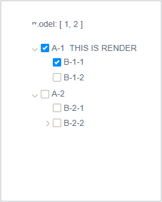

# vue-x-tree

## Install
```
npm i vue-x-tree --save
```

## Tree props

| 属性  | 说明  | 类型            | 默认值  |
| :--- | :----- | :-------------- | :---- |
| tree | 生成tree的数据 | Array | [] |
| keys | 节点字段名 | Object | {titleKey: 'title', childrenKey: 'children', valueKey: 'value'} |
| value | 选中的项目的集合可以使用v-model绑定 | Array | [] |
| link | 选择时是否联动 | Boolean | true |
| render | 自定义的渲染内容 | Function | Null |


### keys
| 属性  | 说明  | 默认值  |
| :--- | :-----| :---- |
| titleKey | 标题 | title |
| childrenKey | 子节点 | children |
| valueKey | checkbox value值 | value |

## children props

| 属性  | 说明  | 类型            | 默认值  |
| :--- | :----- | :-------------- | :---- |
| showDown | 子节点展开状态 | Boolean | ture |
| render | 自定义的子节点渲染内容 | Function | Null |

## demo
```html
<XTree :data="data" v-model="model" :keys="keys" :link="true"></XTree>
```

```js
data() {
    return {
        model: [1, 2],
        keys: {
            titleKey: 'title',
            childrenKey: 'children',
            valueKey: 'id'
        },
        data: [{
            title: 'A-1',
            id: 1,
            render: (h, { root, node, data }) => {
                return h('span', 'THIS IS RENDER')
            },
            children: [{
                title: 'B-1-1',
                id: 2,
            }, {
                title: 'B-1-2',
                id: 3,
            }]
        }, {
            title: 'A-2',
            id: 4,
            children: [{
                title: 'B-2-1',
                id: 5,
            }, {
                title: 'B-2-2',
                id: 6,
                showDown: false,
                children: [{
                    title: 'C-2-1',
                    id: 10,
                }, {
                    title: 'C-2-2',
                    id: 11,
                }]
            }]
        }]
    }
}
```


